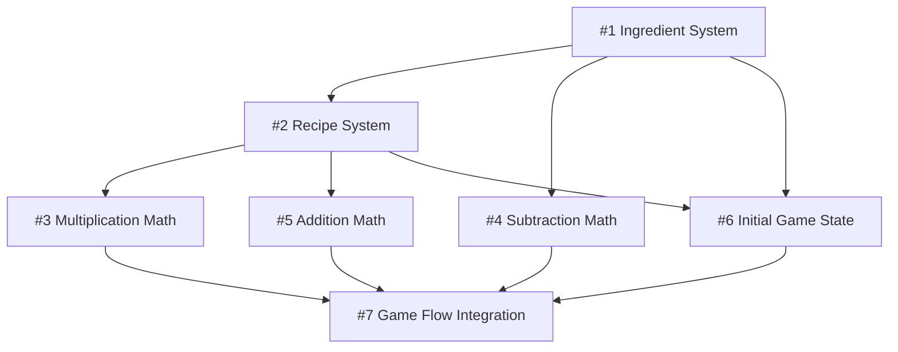

# BakeWatt Development Roadmap

## 🎯 Vision
Transform BakeWatt from a multiplication visualizer into a complete educational baking game that teaches math through recipe management and ingredient operations.

## 📋 Epic Overview

### Phase 1: Core Game Systems (Issues #1-#2)
**Estimated Time: 5-7 hours**

#### #1 Core Ingredient System ⏱️ 2-3 hours
- Domain models for ingredients and pantry management
- Foundation for all math operations
- **Completion**: Pantry can track flour, butter, eggs inventory

#### #2 Recipe Collection System ⏱️ 3-4 hours  
- Recipe domain models with scaling capabilities
- Starter recipe: Simple Cookies (2 servings base)
- **Completion**: Players can view and scale recipes

### Phase 2: Math Mechanics (Issues #3-#5)
**Estimated Time: 11-14 hours**

#### #3 Multiplication Math - Recipe Scaling ⏱️ 4-5 hours
- Integrate existing cube visualization with recipe scaling
- Learn multiplication through serving size changes
- **Completion**: Scale Simple Cookies from 2 to 6 servings (2×3=6)

#### #4 Subtraction Math - Pantry to Counter ⏱️ 4-5 hours
- Move ingredients from pantry to baking counter
- Learn subtraction through resource management
- **Completion**: Transfer 6 cups flour (10-6=4 remaining)

#### #5 Addition Math - Multi-Recipe Planning ⏱️ 3-4 hours
- Combine ingredient needs across multiple recipes
- Learn addition through batch planning
- **Completion**: Plan cookies + muffins (6+3=9 cups flour)

### Phase 3: Game Experience (Issues #6-#7)
**Estimated Time: 8-10 hours**

#### #6 Initial Game State & Tutorial ⏱️ 3-4 hours
- Set up starting resources: 15 cups flour, 6 sticks butter, 12 eggs
- Tutorial introduction to core mechanics
- **Completion**: New players can immediately start learning

#### #7 Game Flow Integration ⏱️ 5-6 hours
- Navigation between pantry, recipes, and math challenges
- Unified user experience and workflow
- **Completion**: Complete game loop from recipe selection to completion

## 🚀 Development Sequence

### Sprint 1: Foundation (Issues #1-#2)
```
Day 1: Issue #1 - Ingredient System
Day 2: Issue #2 - Recipe System
```

### Sprint 2: Core Math (Issues #3-#4)  
```
Day 3: Issue #3 - Multiplication (Recipe Scaling)
Day 4: Issue #4 - Subtraction (Pantry Management)
```

### Sprint 3: Advanced Math & Polish (Issues #5-#7)
```
Day 5: Issue #5 - Addition (Multi-Recipe Planning)
Day 6: Issue #6 - Initial Game State & Tutorial
Day 7: Issue #7 - Game Flow Integration
```

## 🔄 Dependencies



## 📊 Success Metrics

### Technical Completion
- [ ] All 7 issues completed with acceptance criteria met
- [ ] TypeScript compilation passes
- [ ] 80%+ test coverage maintained
- [ ] Performance targets met (60fps, <3s load)

### Educational Effectiveness  
- [ ] Clear multiplication learning through recipe scaling
- [ ] Intuitive subtraction through ingredient management
- [ ] Engaging addition through multi-recipe planning
- [ ] Tutorial successfully onboards new players

### User Experience
- [ ] Seamless navigation between game areas
- [ ] Responsive design works on desktop and mobile
- [ ] Game state persists across sessions
- [ ] Math problems feel naturally integrated

## 🎮 Target Game Loop

1. **Select Recipe** → Browse recipe book, choose what to bake
2. **Scale Recipe** → Multiplication math to adjust serving size
3. **Gather Ingredients** → Subtraction math to move pantry → counter
4. **Combine Recipes** → Addition math for multi-recipe planning
5. **Complete & Celebrate** → Success feedback and progression

## 🔮 Future Expansion (Post-MVP)

- **Division Math**: Recipe reduction and portion splitting
- **Fraction Math**: Partial ingredient usage (1/2 cup, 3/4 stick)
- **Recipe Unlocking**: Progression system with new recipes
- **Achievement System**: Math mastery and baking accomplishments
- **Social Features**: Share recipes and compete with friends
- **Energy System**: Oven power management from original concept

## ⚡ High Velocity Tips

1. **Issue-Driven Development**: Each issue is self-contained with clear acceptance criteria
2. **Domain-First Approach**: Build business logic before UI for faster testing
3. **Incremental Integration**: Each issue builds on previous work
4. **Visual Testing**: Use existing cube system for immediate feedback
5. **Parallel Development**: Some issues can be worked simultaneously by different developers

---

**Total Estimated Effort**: 24-31 hours  
**Target Timeline**: 1-2 weeks for complete game transformation